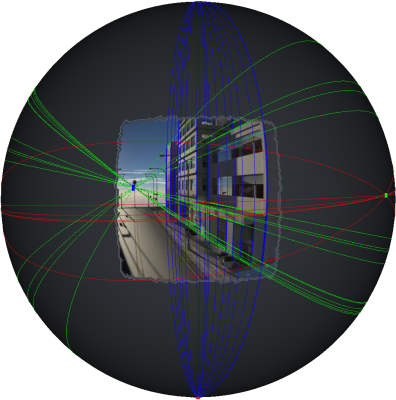
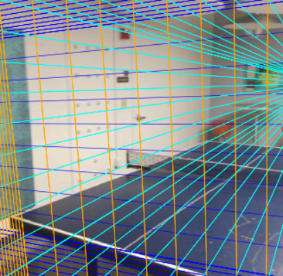
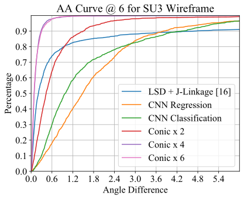
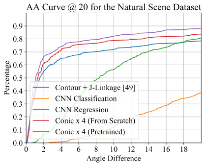
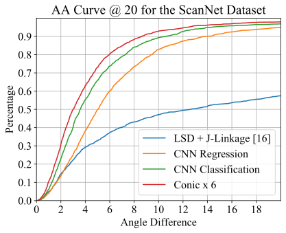

# NeurVPS: Neural Vanishing Point Scanning via Conic Convolution

This repository contains the official PyTorch implementation of the paper:  *[Yichao Zhou](https://yichaozhou.com), [Haozhi Qi](http://haozhi.io), [Jingwei Huang](http://stanford.edu/~jingweih/), [Yi Ma](https://people.eecs.berkeley.edu/~yima/). ["NeurVPS: Neural Vanishing Point Scanning via Conic Convolution"](https://arxiv.org/abs/1910.06316)*. NeurIPS 2019.

## Introduction

NeurVPS is an end-to-end trainable deep network with *geometry-inspired* convolutional operators for detecting vanishing points in images.  With the power of data-driven approaches and geometrical priors, NeurVPS is able to outperform the previous state-of-the-art vanishing point detection methods such as [LSD/J-Linkage](https://github.com/simbaforrest/vpdetection) and [Contour (TMM17)](https://github.com/heiheiknight/vpdet_tmm17).

## Main Results

### Qualitative Measures

| [SceneCity Urban 3D (SU3)](https://arxiv.org/abs/1905.07482) | [Natural Scene (TMM17)](https://faculty.ist.psu.edu/zzhou/projects/vpdetection/) | [ScanNet](http://www.scan-net.org/) |
| ------------------------------------------------------------ | ------------------------------------------------------------ | ----------------------------------- |
|                                        |                                      |         |

Some random sampled results can also be found in the [supplementary material](https://yichaozhou.com/publication/1905neurvps/appendix.pdf) of the paper.

### Quantitative Measures

| [SceneCity Urban 3D (SU3)](https://arxiv.org/abs/1905.07482) | [Natural Scene (TMM17)](https://faculty.ist.psu.edu/zzhou/projects/vpdetection/) | [ScanNet](http://www.scan-net.org/)    |
| ------------------------------------------------------------ | ------------------------------------------------------------ | -------------------------------------- |
|                                  |                            |  |

Here, the x-axis represents the angle accuracy of the detected vanishing points and the y-axis represents the percentage of the results whose error is less than that. Our conic convolutional networks outperform all the baseline methods and previous state-of-the-art vanishing point detection approaches, while naive CNN implementations might under-perform those traditional methods, especially in the high-accuracy regions.

### Code Structure

Below is a quick overview of the function of each file.

```bash
########################### Data ###########################
data/                           # default folder for placing the data
    su3/                        # folder for SU3 dataset
    tmm17/                      # folder for TMM17 dataset
    scannet-vp/                 # folder for ScanNet dataset
logs/                           # default folder for storing the output during training
########################### Code ###########################
config/                         # neural network hyper-parameters and configurations
    su3.yaml                    # default parameters for SU3 dataset
    tmm17.yaml                  # default parameters for TMM17 dataset
    scannet.yaml                # default parameters for scannet dataset
dataset/                        # all scripts related to data generation
    su3.py                      # script for pre-processing the SU3 dataset to npz
misc/                           # misc scripts that are not important
    find-radius.py              # script for generating figure grids
neurvps/                        # neurvps module so you can "import neurvps" in other scripts
    models/                     # neural network architectures
        cpp/                    # CUDA kernel for deformable convolution
        deformable.py           # python wrapper for deformable convolution layers
        conic.py                # conic convolution layers
        hourglass_pose.py       # backbone network
        vanishing_net.py        # main network
    datasets.py                 # reading the training data
    trainer.py                  # trainer
    config.py                   # global variables for configuration
    utils.py                    # misc functions
train.py                        # script for training the neural network
eval.py                         # script for evaluating a dataset from a checkpoint
```

## Reproducing Results

### Installation

For the ease of reproducibility, you are suggested to install [miniconda](https://docs.conda.io/en/latest/miniconda.html) (or [anaconda](https://www.anaconda.com/distribution/) if you prefer) before following executing the following commands. 

```bash
git clone https://github.com/zhou13/neurvps
cd neurvps
conda create -y -n neurvps
source activate neurvps
# Replace cudatoolkit=10.1 with your CUDA version: https://pytorch.org/get-started/
conda install -y pytorch cudatoolkit=10.1 -c pytorch
conda install -y tensorboardx -c conda-forge
conda install -y pyyaml docopt matplotlib scikit-image opencv tqdm
mkdir data logs
```

### Downloading the Processed Datasets
Make sure `curl` is installed on your system and execute
```bash
cd data
../misc/gdrive-download.sh 1yRwLv28ozRvjsf9wGwAqzya1xFZ5wYET su3.tar.xz
../misc/gdrive-download.sh 1rpQNbZQEUff2j2rxr3mBl6xohGFl6sLv tmm17.tar.xz
../misc/gdrive-download.sh 1y_O9PxZhJ_Ml297FgoWMBLvjC1BvTs9A scannet.tar.xz
tar xf su3.tar.xz
tar xf tmm17.tar.xz
tar xf scannet.tar.xz
rm *.tar.xz
cd ..
```

If `gdrive-download.sh` does not work for you, you can download the pre-processed datasets
manually from our [Google
Drive](https://drive.google.com/drive/folders/1xBcHj584zGxhMboZNJHWlAe_XIbHfC34) and proceed
accordingly.


### Training
Execute the following commands to train the neural networks from scratch on 2 GPUs (GPU 0 and GPU 1, specified by `-d 0,1`) with the default parameters:
```bash
python ./train.py -d 0,1 --identifier su3 config/su3.yaml
python ./train.py -d 0,1 --identifier tmm17 config/tmm17.yaml
python ./train.py -d 0,1 --identifier scannet config/scannet.yaml
```

The checkpoints and logs will be written to `logs/` accordingly. It has been reported that it is possible to achieve higher performance with 4-GPU training, though the training process is more volatile.

### Pre-trained Models

You can download our reference pre-trained models from [Google
Drive](https://drive.google.com/drive/folders/1srniSE2JD6ptAwc_QRnpl7uQnB5jLNIZ).  Those pre-trained
models should be able to reproduce the numbers in our paper.

### Evaluation

Execute the following commands to compute and plot the angular accuracy (AA) curves with trained network checkpoints:

```bash
python eval.py -d 0 logs/YOUR_LOG/config.yaml logs/YOUR_LOG/checkpoint_best.pth.tar
```
### FAQ

#### What is the unit of focal length in the yaml and why do I need it?
**A:** The focal length in our implementation is in the unit of 2/w pixel (w is the image width. only a square image is supported). This follows the convention of the OpenGL projection matrix so that to make it resolution invariant.  The focal length is used for uniform sampling of the position of vanishing points. If it is not known, you can set it to some common focal length for your categories of images, as we do in [config/tmm17.yaml](https://github.com/zhou13/neurvps/blob/master/config/tmm17.yaml).

You can also check the function `to_label` and `to_pixel`, which use the focal length to convert the 3D line direction from and to a 2D vanishing point.

#### I have a question. How could I get help?
**A:** You can post an issue on Github, which might help other people that have the same question. You can also send me an email if you think that is more appropriate.

### Acknowledgement
We thank Yikai Li from SJTU and Jiajun Wu from MIT for pointing out an error in the data augmentation code for the TMM17 Natural Scene dataset.  This work is partially supported by the funding from Berkeley EECS Startup fund, Berkeley FHL Vive Center for Enhanced Reality, research grants from Sony Research, and Bytedance Research Lab (Silicon Valley).

### Citing NeurVPS

If you find NeurVPS useful in your research, please consider citing:

```
@inproceedings{zhou2019neurvps,
 author={Zhou, Yichao and Qi, Haozhi and Huang, Jingwei and Ma, Yi},
 title={NeurVPS: Neural Vanishing Point Scanning via Conic Convolution},
 booktitle={NeurIPS},
 year={2019}
}
```
